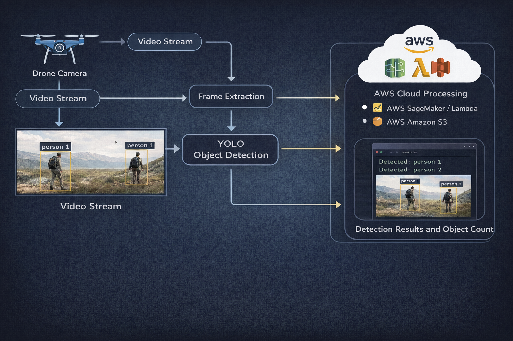

# ASTROVA Drone Surveillance Project

## Overview
During my internship at Astrova Aerospace Pvt Ltd, I contributed to a drone-based computer vision system used for surveillance and monitoring applications.

The system processes aerial video frames and uses object detection models to identify and count objects from drone footage.

## My Contributions

- Designed and deployed YOLO-based object detection pipelines for real-time livestock monitoring from drone footage
- Processed and annotated 10,000+ drone image frames, reducing false positives by ~20% in dense livestock scenarios
- Built scalable ML inference workflows on AWS SageMaker and S3 for production-grade deployment
- Containerized model serving using Docker and Amazon ECR for consistent and repeatable deployments
- Architected serverless inference pipeline using AWS Lambda, eliminating always-on compute and reducing infrastructure costs

## Technologies Used

| Layer | Technology | Purpose |
|---|---|---|
| Object Detection | YOLO + OpenCV | Real-time detection from drone footage |
| Model Training | Python + Scikit-learn | Model development and evaluation |
| Cloud Inference | AWS SageMaker | Scalable ML inference pipeline |
| Serverless Trigger | AWS Lambda | Event-driven inference without always-on compute |
| Storage | Amazon S3 | Drone footage and model artifact storage |
| Containerization | Docker + Amazon ECR | Consistent and repeatable deployments |
  

## Use Cases

- Border surveillance
- Wildlife monitoring
- Disaster response monitoring
- Crowd monitoring
- Security surveillance

 ## Possible Enhancements

- Real-time drone video streaming
- Edge deployment using NVIDIA Jetson
- Multi-object tracking
- Integration with live dashboard for monitoring 

## Note
This repository highlights the system architecture, deployment workflow, and my technical contributions during the internship. Source code and production assets are not publicly shared due to organizational confidentiality policies. 

## Internship Verification

Official internship completion certificate issued by Astrova Aerospace Pvt Ltd.

[View Certificate](./internship_certificate.pdf)

## System Architecture

## Key Learnings

- Learned how to design and deploy production-grade ML pipelines on AWS — from model training to serverless inference using SageMaker and Lambda
- Understood the importance of data quality in real-world CV systems — annotating 10,000+ frames taught me how dataset quality directly impacts model performance
- Gained hands-on experience with event-driven architecture — using Lambda triggers to eliminate always-on compute and reduce infrastructure costs
- Learned how to containerize ML models using Docker and Amazon ECR for consistent, repeatable deployments across environments
